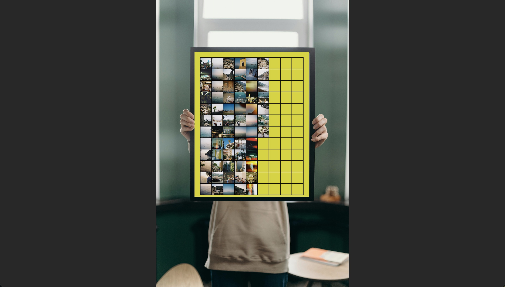
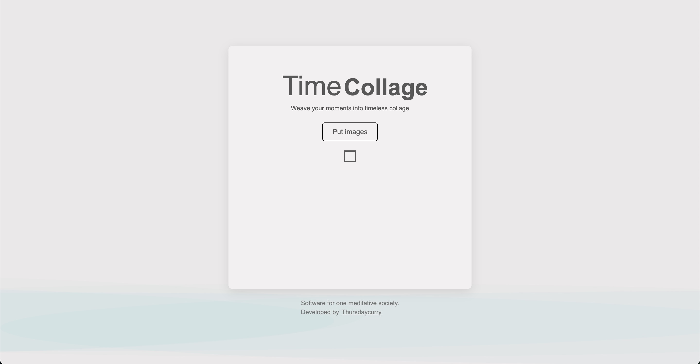
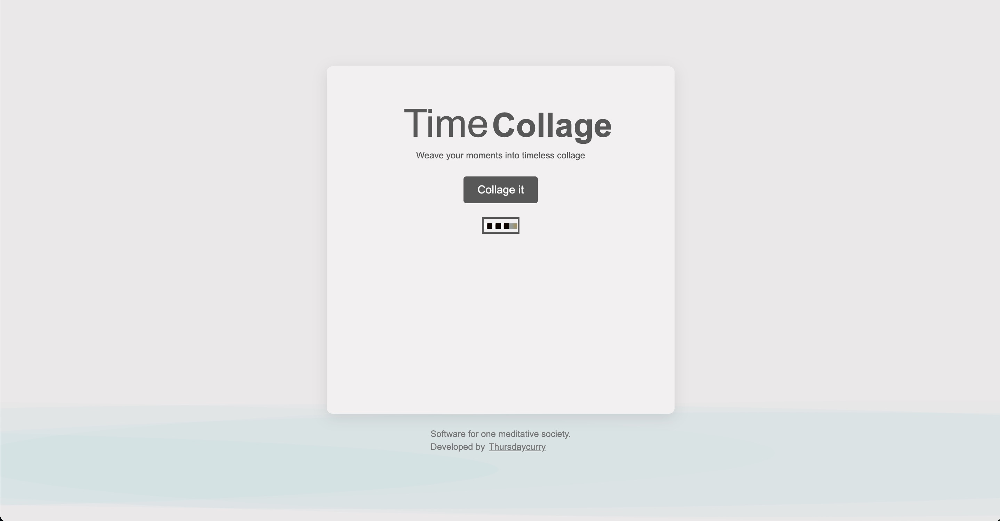
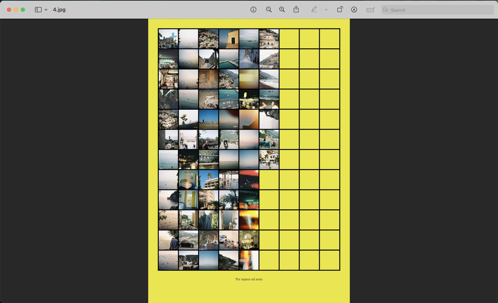

# Time Collage



[Create Your Own Collage Here!](https://timecollage.pages.dev/)

**Time Collage** is a web application that allows you to seamlessly weave your visual moments into a structured collage. The generated collage follows a **9 × 12 grid format**, offering a visually cohesive presentation of your images.

## Features

- **Easy Image Upload** – Add your images effortlessly.
- **Automated Collage Generation** – Arrange images into a structured format.
- **PDF Export** – Download your collage as a high-quality PDF.





## How to Use

1. **Upload Images** – Select and upload the images you want to include.
2. **Generate Collage** – Request the system to create your collage.
3. **Download** – The collage is automatically generated and downloaded in **PDF format**.

## Installation Guide

To run the project locally, follow these steps:

1. **Clone the Repository**
   ```sh
   git clone https://github.com/your-repository/time-collage.git
   cd time-collage
   ```

2. **Install Dependencies**
   ```sh
   npm install
   ```

3. **Start the Development Server**
   ```sh
   npm run dev
   ```

4. **Open in Browser**
   Navigate to `http://localhost:5173` in your browser.

## License
This project is licensed under the **MIT License**.

---

For any inquiries or contributions, feel free to open an issue or submit a pull request!

